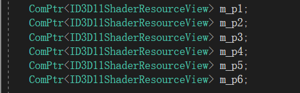
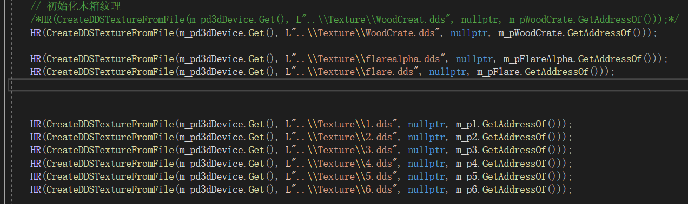
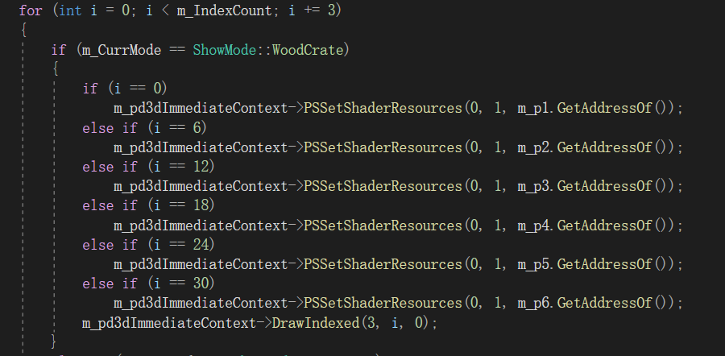
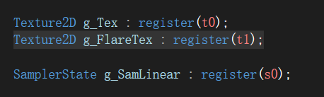
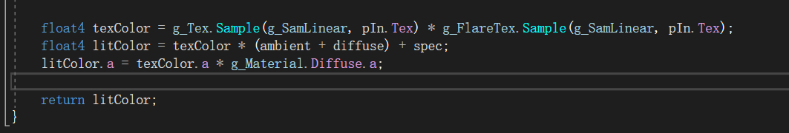
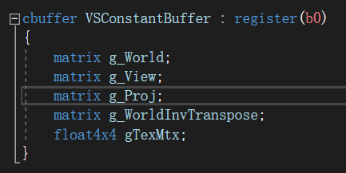
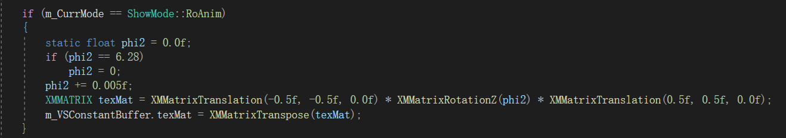
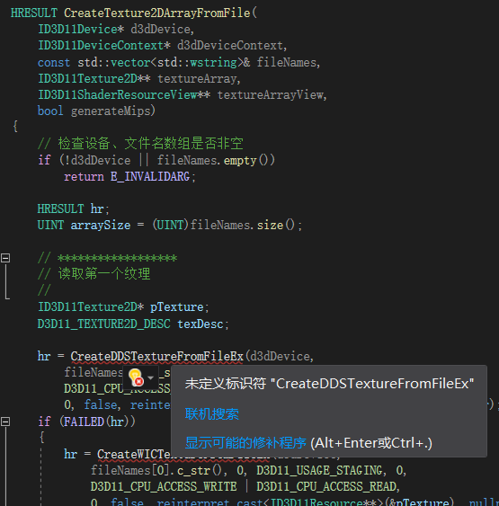
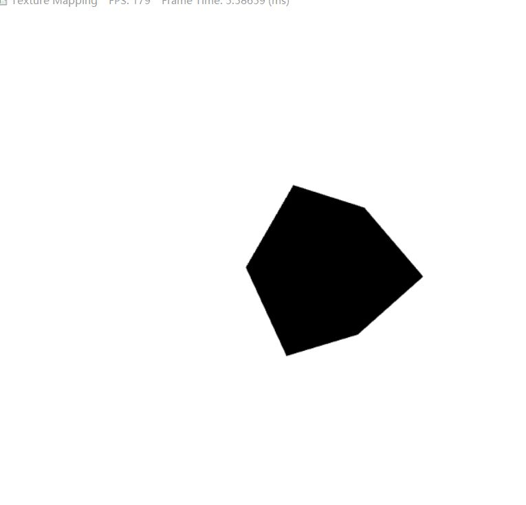

## 小组第四次作业文档

#### 1、作业要求

​		实现一个立方体6张不同纹理，用平行光

​		用纹理数组实现动画

​		实现旋转纹理与关灯

#### 2、代码

​	作业一、

​	相关代码

​	代码实现

作业二、

​	因文件问题，无法实现。具体在第四大点说明

​	运用原本代码实现

作业三、

​	代码

​	纹理合并：

​		//Basic.hlsl

​                                     	

​	//Basic_PS_3D.hlsl

​	旋转实现

​	//Basic.hlsl

​	//GameApp.cpp

开关灯实现

​	实现结果

#### 4、存在问题与解决方法

​	问题1：纹理数组无法实现，原因：引用WICTextureLoader.cpp，DDSTextureLoader.cpp失效

分析：include失效原因有1、#ifndef或#pragma once影响。2、函数名错误。3、头文件引用顺序导致。4、库的有关依赖文件路径存在问题。	                                                                                                                                                        解决方法：针对1~3尝试进行修改，但没作用，而且对框架不太熟悉，#ifndef或#pragma once不敢乱删。第4点也是，不会修改。                                                                                                                                                                             结果：无法使用纹理数组相关函数，无法实现作业。

问题2：实现对应的代码，纹理无法旋转。分析：代码错误，或未能成功传入转换矩阵。             解决方法：分析代码，未发现问题、图形调试，发现对应的变量已发生变换。一直找不到问题所在，询问后被建议将cso删除，重新编译。成功旋转

问题3：修改灯光后出现：

分析：纹理，材质、灯光存在问题。                                                                                                                                  解决方法：检查，不能修复。重新创新文件，复制代码和着色器，成功修复。因此可能是着色器cso文件问题

#### 5、心得体会

​	本次小组作业完成时比较难，要细看博客文献，理解相关内容。但完成后感觉步骤也十分简单。关于上述问题bug，修复时间过长，导致提交时间很晚。

#### 6、参考文献

​	CSDN博客